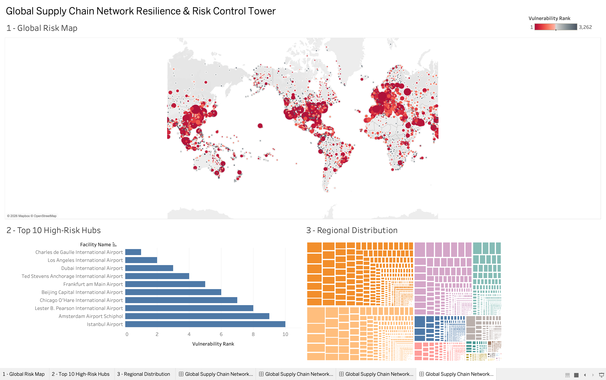

# Global Airline Network: Supply Chain Resilience & Operational Risk Analytics

This project looks at the global airline network the way you'd look at a
logistics network, and answers two practical questions:

1. If an airport went out of service, how much damage would it do to the rest
   of the network?
2. If a delay started at a major hub, how far and how fast would it spread?

The code began as an academic flight-network analysis and was reorganized into
three steps: clean the raw data with SQL, measure the network with Python, and
simulate a hub outage.

## Data source

All data comes from **OpenFlights** (<https://openflights.org/data.php>), an
open dataset. Two files are used, and both are already included in this
repository. They are plain comma-separated text with **no header row**, and
missing values are written as `\N`.

**`airports.dat`** — one row per airport (7,698 rows). The 14 columns, in order,
are: airport ID, name, city, country, **IATA code** (3 letters), ICAO code
(4 letters), latitude, longitude, altitude (feet), UTC offset, daylight-saving
flag, timezone name, type, and data source. We only use the IATA code, name,
city, country, and coordinates.

```
1,"Goroka Airport","Goroka","Papua New Guinea","GKA","AYGA",-6.0817,145.392,5282,10,"U","Pacific/Port_Moresby","airport","OurAirports"
```

**`routes.dat`** — one row per route an airline operates (67,663 rows). The 9
columns are: airline code, airline ID, **source airport** (IATA), source airport
ID, **destination airport** (IATA), destination airport ID, codeshare flag,
number of stops, and equipment. We only use the source and destination codes.

```
2B,410,AER,2965,KZN,2990,,0,CR2
```

Two caveats worth stating up front:

- This is a **one-time snapshot**, not a live feed. The route list does not
  reflect current schedules.
- A "route" here means an airline flies that pair, not how many flights or
  passengers. When the code talks about route *frequency* or shipment volume, it
  means the number of airlines flying a pair, which is the closest proxy the
  data allows.

## Repository layout

```
.
├── sql/
│   └── 01_data_extraction.sql      # clean the raw files in SQLite, build a view
├── src/
│   ├── 02_network_analytics.py     # network metrics, hub clustering, stress test
│   └── 03_delay_simulation.py      # delay-spread simulation
├── output/                         # generated CSVs and PNGs
├── dashboards/
│   ├── network.twbx                # Tableau workbook
│   └── flight_network.png          # screenshot of the dashboard
├── airports.dat                    # source data (OpenFlights)
├── routes.dat                      # source data (OpenFlights)
└── README.md
```

## How the three steps work

**Step 1 — Clean the data in SQL (`sql/01_data_extraction.sql`).**
Loads `airports.dat` and `routes.dat` into a SQLite database, removes records
that can't be used, and leaves two clean tables (`facilities`, `lanes`) plus a
joined view, `vw_clean_network`. The cleaning rules are:

- drop airports with no IATA code, the `\N` placeholder, or a code that isn't
  3 letters;
- drop airports with missing, non-numeric, or out-of-range coordinates;
- drop routes whose endpoints aren't valid airports, and routes from an airport
  to itself;
- collapse duplicate airport pairs into one row and count how many airlines fly
  it (`shipment_frequency`).

On this dataset, the 7,698 airports reduce to 6,072 clean facilities and the
67,663 routes reduce to 37,041 unique airport pairs.

**Step 2 — Measure the network (`src/02_network_analytics.py`).**
Builds a directed graph where each airport is a node and each airport pair is an
edge weighted by how many airlines fly it. It then computes three scores per
airport, grouped under the name **Network Vulnerability Index**:

| Plain meaning | Technical name |
|---|---|
| How many other airports it connects to | degree |
| How often it sits on the shortest path between two others | betweenness |
| How well-connected its neighbours are | eigenvector |

It also groups airports into **regional hubs** (Louvain clustering — finding
clusters of airports that mostly connect among themselves) and runs a **stress
test** that removes the busiest airports one by one to see how quickly the
network breaks into disconnected pieces. The per-airport scores are written to
`output/facility_metrics.csv`.

**Step 3 — Simulate a disruption (`src/03_delay_simulation.py`).**
A standard SIR spread model with the three states renamed: Normal Operations,
Delayed, Recovered Operations. It starts a delay at the single busiest airport
(Frankfurt, in this data), then steps through time: each step, delays can spread
to connected airports with probability `beta`, and delayed airports recover with
probability `gamma`. `beta` is set higher than `gamma` deliberately, so the
delay spreads faster than it clears — that's the condition under which a single
outage cascades. The result is saved as
`output/delay_propagation_stress_test.png`.

### How the steps connect (important)

The SQL step and the Python steps are **independent**. The Python scripts do not
read the SQLite database; they load `airports.dat` and `routes.dat` directly and
apply the same cleaning rules in pandas. So:

- Run **step 1** when you want the cleaned data in a queryable SQL database.
- Run **steps 2 and 3** to produce the metrics CSV and the charts. They work
  whether or not you ran step 1.

## Running it

Requirements: Python 3.8 or newer with `pandas`, `numpy`, `networkx`,
`matplotlib`, and `python-louvain`, plus the `sqlite3` command-line tool.
`cartopy` is optional — it only produces the world-map image; without it the
scripts skip that one chart and finish normally.

```bash
pip install pandas numpy networkx matplotlib python-louvain
```

Run the commands from the project root. The SQL script uses relative paths
(`.import airports.dat ...`), so it won't find the data files from another
directory.

```bash
# Step 1: clean the data. Creates supply_chain.db in the current folder.
sqlite3 supply_chain.db ".read sql/01_data_extraction.sql"

# Step 2: network metrics, stress test, and the CSV export.
python src/02_network_analytics.py

# Step 3: the delay simulation.
python src/03_delay_simulation.py
```

`supply_chain.db` does not exist beforehand — `sqlite3` creates it the first time
you run step 1. The file name is just a choice; any name works.

Note: step 2 computes betweenness on the full graph, which takes a couple of
minutes on a few thousand airports. That is expected.

## Outputs

Everything is written to `output/`. Each file and where it comes from:

| File | Produced by | What it is |
|---|---|---|
| `facility_metrics.csv` | step 2 (`export_facility_metrics`) | One row per airport, formatted for Tableau or Power BI. Columns: `vulnerability_rank`, `facility_iata`, `facility_name`, `city`, `country`, `latitude`, `longitude`, `degree`, `in_degree`, `out_degree`, `betweenness`, `influence_score`, `total_shipment_volume`, `regional_hub_id`. |
| `throughput_distribution.png` | step 2 (`plot_throughput_distribution`) | Histogram of how many other airports each airport connects to (degree). |
| `disruption_resilience.png` | step 2 (`visualize_disruption_resilience`) | Two trend charts — largest connected cluster and number of fragments as the busiest airports are removed one by one — plus a table of the first 10 removed. |
| `delay_propagation_stress_test.png` | step 3 (`plot_delay_curves`) | The Normal / Delayed / Recovered curves over time, showing the worst point of the disruption and how long recovery takes. |

## Dashboard

`dashboards/` holds a Tableau dashboard built on top of `facility_metrics.csv`,
plus a screenshot of it (`flight_network.png`):



It has three panels:

1. **Global Risk Map** — every airport plotted by location, colored by
   `vulnerability_rank` (the riskiest chokepoints stand out in red).
2. **Top 10 High-Risk Hubs** — the ten airports with the highest vulnerability
   rank, as a bar chart.
3. **Regional Distribution** — a treemap of the `regional_hub_id` clusters,
   sized by how many airports fall in each.

To open or edit it yourself, load `dashboards/network.twbx` in Tableau and point
it at a freshly generated `output/facility_metrics.csv`.
